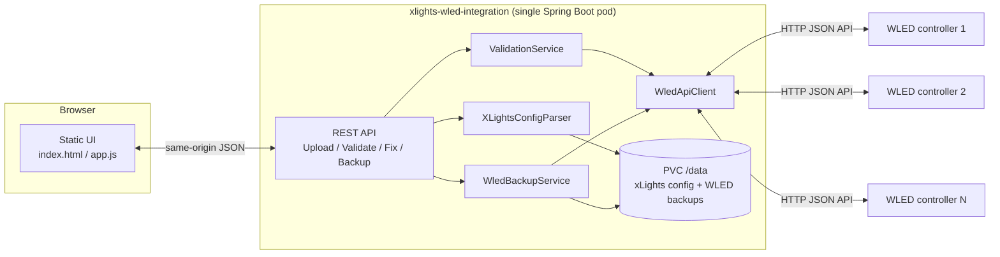

# xLights ⇄ WLED

Keep your [xLights](https://xlights.org/) show layout and your live [WLED](https://kno.wled.ge/) controllers honest with each other — from a browser, with an automatic safety net.

<p>
  <a href="https://github.com/ketronkowski/xlights-wled-integration/actions/workflows/ci.yml"></a>
  
  
  
  
  
  <a href="https://github.com/ketronkowski/xlights-wled-integration/commits/main"></a>
  
  <a href="CONTRIBUTING.md"></a>
</p>

## Why this exists

Every light-show season starts the same way: xLights knows what segments each [QuinLED](https://quinled.info/)/WLED controller *should* have (names, pixel ranges, which ones are gap/"null" placeholders), and the WLED devices out in the yard have whatever segments they were last configured with — which drifts. IP addresses change on DHCP renewal, segment ranges get hand-edited on a device and never reconciled back, and there's no single place to ask "does what's programmed into the WLED controllers actually match what xLights thinks the layout is?"

This app answers that question, and can fix the drift for you:

- **Validate** — upload your xLights show's config, and it live-checks every controller against its actual WLED device: LED count, segment ranges, and which segments should be off ("null" models).
- **Fix** — push the corrected segment layout to a device in one click (or in bulk).
- **Never lose a config again** — every fix is preceded by an automatic backup of that device's `cfg.json` and `presets.json` (network config + presets/playlists), because segment fixes used to be applied blind with no way to recover if something went wrong. Manual backup/restore is available any time, not just around fixes.
- **Start fresh** — "Clear All Controllers" resets every reachable WLED device to its own hardware-default segments and wipes all locally stored backups and the uploaded xLights config in one confirmed action, for when a season's layout is retired and you want a clean slate. There's no backup-before-wipe here — it's deliberately final.

It originally started life as a local-only Kotlin CLI you had to run on one specific Macbook. It's now a small web app that lives in the homelab Kubernetes cluster, reachable from any browser on the network — no terminal, no "which laptop has the right JAR" required.

## How it works



- **One container, no separate frontend build.** Spring MVC serves the REST API and a small vanilla-JS/HTML/CSS UI from the same origin (`src/main/resources/static/`) — no React/Vite pipeline, no CORS to configure.
- **Card or list view.** Controllers render as a card grid by default, or toggle to a compact table-style list when you've got more devices than comfortably fit as cards — both share the same selection state and bulk actions, and your choice persists across reloads via `localStorage`.
- **Browser-side folder access, not a file upload form.** The UI uses the [File System Access API](https://developer.mozilla.org/en-US/docs/Web/API/File_System_Access_API) to read `xlights_networks.xml` / `xlights_rgbeffects.xml` directly out of your xLights show folder and POSTs their contents as JSON — no multipart upload, and it only ever touches the two files it needs (not every rendered sequence/media file in the show directory).
- **Virtual threads instead of a reactive stack.** The outbound calls to WLED devices used to go through WebFlux's `WebClient`, but every call was immediately `.block()`-ed anyway — so it's plain Spring MVC + `RestClient`, with `spring.threads.virtual.enabled=true` keeping the parallel per-device fetches cheap.
- **A tiny PVC is the only state.** The uploaded xLights XML and every WLED backup (`cfg.json`/`presets.json`, a few KB each) live under one mounted volume — no database.

### Key packages

| Package | Responsibility |
|---|---|
| `xlights` | Parses `xlights_networks.xml` / `xlights_rgbeffects.xml` into domain objects |
| `wled` | Talks to the WLED JSON API (`WledApiClient`) and owns config/preset backup & restore (`WledBackupService`) |
| `validation` | Compares xLights' expected layout against live WLED state and applies fixes (`ValidationService`) |
| `web` | REST controllers: upload, validate/fix, backups |
| `domain` | Plain data classes shared across the above |
| `system` | Orchestrates the destructive "Clear All Controllers" reset (`SystemResetService`) |

### REST API

| Method | Path | Purpose |
|---|---|---|
| `POST` | `/api/upload` | Store an uploaded show's `xlights_networks.xml` / `xlights_rgbeffects.xml` |
| `GET` | `/api/upload/status` | Last upload's label + timestamp (404 if none yet) |
| `POST` | `/api/validate` | Live-check every controller against its WLED device |
| `POST` | `/api/fix` | Backup + patch only the segments that are out of sync |
| `POST` | `/api/fix-all` | Backup + fully rebuild a device's segments from xLights |
| `GET` | `/api/backups` | List backups (optionally `?controller=Octa1`) |
| `POST` | `/api/backups/{controller}` | Manual backup-now |
| `POST` | `/api/backups/{controller}/restore/{timestamp}` | Restore a backup and reboot the device |
| `POST` | `/api/system/reset` | Factory reset: every reachable WLED device to hardware-default segments + delete all backups and the uploaded config (no backup taken first) |

## Running locally

Requires JDK 21 (the Gradle toolchain will provision one if you don't have it).

```bash
./gradlew bootJar
java -jar build/libs/xlights-wled-integration.jar
```

Open `http://localhost:8080`. By default it stores uploaded config + backups under `/data`; override that for local testing:

```bash
XLIGHTS_DATA_DIR=/tmp/xlights-wled-data java -jar build/libs/xlights-wled-integration.jar
```

Run the test suite with `./gradlew test`. One test class, `OctaValidationIT`, talks to real WLED hardware and a real xLights show directory (`~/xlights/Christmas 2023`) — it's gated behind `@EnabledIf` and automatically skips itself (rather than failing) whenever that directory doesn't exist, which is exactly the case in CI.

## Building the container image

```bash
docker build -t xlights-wled-integration:local .
```

The `Dockerfile` is a multi-stage build: the compile stage always runs on the build machine's *native* platform (via `--platform=$BUILDPLATFORM`) so Gradle never runs under slow QEMU emulation, and only the final ~180MB `eclipse-temurin:21-jre-alpine` runtime stage gets cross-built for the target platform. To build (and push) both architectures the way CI does:

```bash
docker buildx build --platform linux/amd64,linux/arm64 -t ghcr.io/ketronkowski/xlights-wled-integration:local --push .
```

## Deploying to Kubernetes

This repo builds the image; the actual Kubernetes manifests (Deployment, PVC, Service, Traefik `IngressRoute`, cert-manager `Certificate`) live in a separate GitOps repo and are synced by ArgoCD — see `.github/workflows/ci.yml`'s `deploy` job, which patches that repo's `values.yaml` with the newly-built image tag on every push to `main`.

If you're standing this up on your own cluster, here's what it expects:

- **A `linux/arm64` (or `amd64`) node** — the published image is multi-arch, built and tested on a Raspberry Pi k3s cluster.
- **An RWO-capable `StorageClass`** for a small `PersistentVolumeClaim` (2Gi is comfortably more than enough — the uploaded xLights XML is a few hundred KB and each WLED backup is single-digit KB, so even years of per-fix backups across a handful of devices won't come close to filling it). The reference deployment uses [Longhorn](https://longhorn.io/).
- **A Traefik ingress controller** if you reuse the `IngressRoute` CRD as-is (swap in a standard `Ingress` otherwise) and **cert-manager** with a `ClusterIssuer` if you want the `Certificate` resource to provision TLS automatically.
- **Modest resources**: the reference deployment requests `100m` CPU / `256Mi` memory with a `512Mi` memory limit — this is a low-traffic, seasonal internal tool, not something that needs headroom for concurrent load.
- **Network reachability from the pod to your WLED devices'** LAN — the pod calls out to each device's `/json/*` HTTP API directly by IP/hostname (no `hostNetwork`, no mDNS discovery in-cluster), so make sure routing allows that.
- **`XLIGHTS_DATA_DIR`** environment variable pointing at the PVC's mount path (defaults to `/data`).

## CI/CD

Every push to `main` runs: **test** → **build & push** a multi-arch image to `ghcr.io/ketronkowski/xlights-wled-integration` → **patch** the GitOps deploy repo's image tag, which ArgoCD then syncs automatically.

Every pull request also gets its own **live preview environment** — a build tagged `pr-<number>` is deployed to an isolated namespace on the homelab cluster and reachable at `https://xlights-wled.lab.ri.tronkowski.net/pr-<number>/`, completely separate from production. The link is posted as a comment on the PR, updates automatically on every push, and is torn down automatically (namespace, deploy-repo files, everything) as soon as the PR is closed — merged or not.

`main` is a protected branch — every change, including the maintainer's own, goes through a pull request with passing CI before it merges.

## Releases

Versioned releases are cut automatically by [release-please](https://github.com/googleapis/release-please) from [Conventional Commit](CONTRIBUTING.md#commit--pr-title-convention) PR titles — see the [Releases page](https://github.com/ketronkowski/xlights-wled-integration/releases) and [CHANGELOG.md](CHANGELOG.md) for what shipped in each version.

Each release publishes:
- A semver-tagged multi-arch image — `ghcr.io/ketronkowski/xlights-wled-integration:X.Y.Z` (and a floating `:X` major tag) — alongside the always-current `:latest`/`:<commit-sha>` tags described above.
- A standalone `xlights-wled-integration.jar` attached to the GitHub Release, with a `.sha256` checksum.

To run a specific released version without Docker:

```bash
curl -LO https://github.com/ketronkowski/xlights-wled-integration/releases/download/vX.Y.Z/xlights-wled-integration.jar
java -jar xlights-wled-integration.jar
```

Note: the homelab deployment tracks the latest commit on `main` (`:<sha>`) via continuous GitOps deployment, not tagged releases — see [CI/CD](#cicd) above. Releases are for versioned artifacts/changelog, not what's actually running in the cluster.

## Contributing

Bug reports, feature ideas, and pull requests are welcome — see [CONTRIBUTING.md](CONTRIBUTING.md) for how to file an issue or send a PR.
